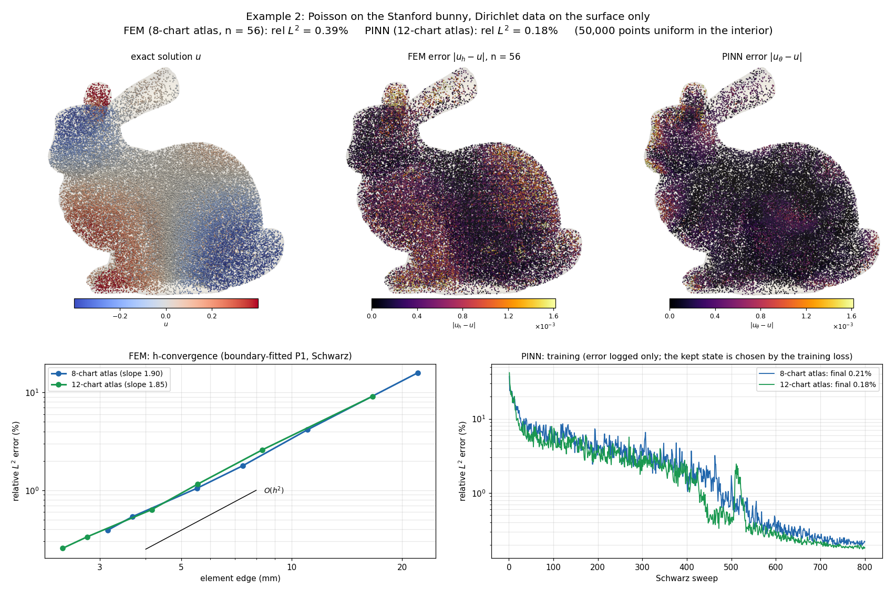

# Geometry-Informed Neural Atlas for Boundary Value Problems of Complex 3D Geometries

Reference implementation accompanying the paper

> **Geometry-informed neural atlas for boundary value problems of complex 3D geometries**
> — WaiChing Sun (Columbia University)

This repository contains the **minimal, self-contained code needed to reproduce the
numerical examples in the paper**. Examples 1 and 3–5 are analytic — the geometry, forcing,
and reference solutions are generated inside the scripts. Example 2 runs on the Stanford
Bunny: it downloads the scan (3 MB) on first use and ships its frozen neural atlas (5 MB).
Run a script and it reproduces the result.

The method covers a 3D solid with an **atlas of overlapping coordinate charts**, each
mapping a reference cube/ball onto a piece of the physical domain. PDEs are pulled back
onto the reference charts through a Piola-type operator map and solved chart-locally with
either a **physics-informed neural network (PINN)** or a **P1 finite-element (FEM)**
discretization; charts are coupled by **multiplicative Schwarz** iteration.

---

## Examples included

The paper has five numerical examples; this repository reproduces all five. The directory
names keep the paper's example numbering so the code maps 1:1 to the text.

| Paper example | Problem | Geometry | Directory |
|---|---|---|---|
| **Example 1** | Verification: Laplace/Poisson equation (PINN) | Ellipsoid | `examples/example1_ellipsoid_laplace/` |
| **Example 2** | Heat conduction / Poisson (Schwarz FEM and PINN on a neural atlas) | Stanford Bunny | `examples/example2_bunny_poisson/` |
| **Example 3** | Forward elastoplastic boundary-value problem (Schwarz FEM) | Torus | `examples/example3_torus_forward_elastoplastic/` |
| **Example 4** | Inverse Neo-Hookean parameter identification | Torus | `examples/example4_torus_inverse_neohookean/` |
| **Example 5** | Inverse elastoplastic parameter identification | Torus | `examples/example5_torus_inverse_elastoplastic/` |

---

## Repository layout

```
mapped-sphere-pinn/
├── README.md
├── LICENSE
├── pyproject.toml            # installable package metadata
├── requirements.txt
│
├── mapped_sphere/            # shared solver library (imported by the examples)
│   ├── device.py             #   CUDA / MPS / CPU device + dtype resolution
│   ├── utils.py              #   RNG seeding
│   ├── geometry.py           #   Jacobians, metrics, gradients, divergence, Laplacian
│   ├── piola.py              #   vector/tensor Piola maps, diffusion, surface measures
│   ├── maps.py               #   analytic torus maps and normals
│   └── elastoplastic/        #   finite-strain elastoplasticity toolkit
│       ├── chart_vector_fem.py   #   P1 tetrahedral vector FEM on a reference chart
│       ├── return_mapping.py     #   differentiable (softplus) J2 return mapping
│       ├── incremental_solver.py #   load-stepping forward solver
│       └── schwarz_vector.py     #   multiplicative Schwarz coupling across charts
│
└── examples/                 # one runnable script per paper example (self-contained drivers)
    ├── example1_ellipsoid_laplace/
    │   └── run_ellipsoid_laplace.py
    ├── example2_bunny_poisson/
    │   ├── run_fem.py               # boundary-fitted P1 FEM on each chart, Schwarz-coupled
    │   ├── run_pinn.py              # one PINN per chart, Schwarz-coupled
    │   ├── plot_results.py          # the Example 2 figure
    │   ├── geometry.py, atlas.py, chart_fem.py
    │   └── assets/                  # frozen 8- and 12-chart neural atlases
    ├── example3_torus_forward_elastoplastic/
    │   └── run_forward_bvp.py
    ├── example4_torus_inverse_neohookean/
    │   ├── run_global_atlas.py      # config (a): single global optimizer
    │   └── run_schwarz_dual.py      # configs (b)/(c): Schwarz, traction / displacement obs.
    └── example5_torus_inverse_elastoplastic/
        └── run_inverse_elastoplastic.py
```

The `examples/` scripts are the entry points. The reusable numerics live in the
`mapped_sphere` package. All five examples import its shared differential geometry
tools. Example 2 keeps its bunny-specific geometry, atlas and FEM modules in its
own directory.

---

## Installation

Requires **Python ≥ 3.9** and PyTorch. A CPU-only install is enough to reproduce every
example; a CUDA or Apple-Silicon (MPS) GPU is used automatically when available.

```bash
# 1. create an environment (any tool works)
python3 -m venv .venv && source .venv/bin/activate

# 2. install the package and its dependencies
pip install -e .
```

`pip install -e .` puts the `mapped_sphere` package on your import path. The example
scripts also add the repository root to `sys.path` themselves, so `python examples/.../run_*.py`
works even without installing — installing is only needed if you want to `import mapped_sphere`
from elsewhere.

If you prefer not to install anything, just install the three dependencies
(`pip install -r requirements.txt`) and run the scripts directly.

Example 2 also needs `scipy` and `pyvista` (VTK) for the exact bunny geometry:

```bash
pip install -e ".[bunny]"      # or: pip install scipy pyvista
```

---

## Quick start

```bash
# reproduce Example 1 (takes ~2 min on a laptop CPU)
python examples/example1_ellipsoid_laplace/run_ellipsoid_laplace.py --output-dir out_ex1
```

Every script accepts `--help` for the full list of options (geometry, hyperparameters,
device, output directory).

---

## Differential geometry and Piola library

The shared API uses `J[..., i, A] = dx_i/dxi_A`. Signed Piola maps use `det(J)`;
volume integration, diffusion, and outward surface measures use `abs(det(J))`.
Singular and nonfinite Jacobians raise `ValueError`; the library never clips or
pseudoinverts them. See [NOTES.md](NOTES.md) for equations, shapes, and scope.

```python
import torch
from mapped_sphere import ChartGeometry, TorusChart, jacobian, laplace_beltrami
from mapped_sphere.piola import diffusion_pullback, contravariant_pullback

xi = torch.tensor([[0.1, 0.2, 0.3]], dtype=torch.float64, requires_grad=True)
chart = TorusChart(R=1.0, r=0.35)
x = chart(xi)
geometry = ChartGeometry(jacobian(x, xi))
A = diffusion_pullback(geometry)              # |det J| J^-1 J^-T
u = x.square().sum(-1)
lap_u = laplace_beltrami(u, xi, geometry)      # Delta_x |x|^2 = 6
flux_ref = contravariant_pullback(x, geometry, oriented=False)
```

| Example | Shared operations used |
|---|---|
| 1: ellipsoid | Affine geometry and Laplace–Beltrami residual |
| 2: bunny FEM | Decoder Jacobian and exact diffusion pullback |
| 2: bunny PINN | Frame gradient and physical divergence |
| 3: forward plasticity | Torus chart, mapped FEM gradients and volumes |
| 4: inverse Neo-Hookean | Torus coordinates, normals, displacement Jacobian |
| 5: inverse plasticity | Torus chart and mapped FEM geometry |

Bunny FEM assembly now uses the exact Jacobian instead of its previous singular
value and determinant clipping. Bunny PINN retains its affine frame coordinates.
Example 4 retains its prescribed-field inverse calculation. The shared API does
not establish chart injectivity, equilibrium convergence, or parameter identifiability.

```bash
pip install -e ".[test,bunny]"
python -m pytest -q
```

The tests include nonlinear mapped operators, Piola divergence and flux identities,
parameter derivatives, and an affine FEM patch. They do not rerun the full paper
training and inverse campaigns.

---

## Reproducing each example

Default arguments are the canonical settings reported in the paper unless noted.
Each script prints its key metrics at the end and writes diagnostics (metrics JSON,
loss curves, and `.vtu` field exports for ParaView) to the output directory.

### Example 1 — Poisson verification on the ellipsoid (PINN)

Manufactured solution `u* = 1 − ‖ξ‖²` on the mapped unit sphere.

```bash
python examples/example1_ellipsoid_laplace/run_ellipsoid_laplace.py --output-dir out_ex1
```

**Expected:** relative L² error ≈ `2.26e-3`, max pointwise error ≈ `5.23e-3`
(Adam, lr `1e-3`, up to 8000 epochs; ~106 s on CPU). Add `--no-plot` to skip figures.

### Example 2 — Poisson on the Stanford Bunny (Schwarz FEM and PINN)



Manufactured solution `u = sin(πx) sin(πy) sin(πz)` with Dirichlet data on the surface, on
a frozen neural atlas of the bunny (8 or 12 overlapping charts). The FEM uses boundary-fitted
P1 elements on each chart; the PINN trains one network per chart. Both are coupled by
multiplicative Schwarz, and the exact solution is used only as boundary data.

```bash
python examples/example2_bunny_poisson/run_fem.py  --n-cells 8 16 24 32 48 56 --output-dir out_ex2_fem
python examples/example2_bunny_poisson/run_pinn.py --output-dir out_ex2_pinn
python examples/example2_bunny_poisson/plot_results.py --fem-dir out_ex2_fem --pinn-dir out_ex2_pinn
```

**Expected:** relative L² error on 50,000 interior points — FEM `0.392 %` (8-chart atlas,
`n = 56`, ~5 min) and `0.255 %` (12-chart); PINN `0.182 %` (12-chart, ~25 min) and `0.211 %`
(8-chart). The FEM converges at second order.
See [`examples/example2_bunny_poisson/README.md`](examples/example2_bunny_poisson/README.md)
for the full refinement table and method notes.

### Example 3 — Forward elastoplastic BVP on the torus (Schwarz FEM)

Cyclic loading of a full torus covered by 8 azimuthal charts, coupled by multiplicative
Schwarz; J₂ plasticity with kinematic hardening and the smooth return mapping.

```bash
python examples/example3_torus_forward_elastoplastic/run_forward_bvp.py --out-dir out_ex3
```

**Expected:** the run reports max displacement, accumulated plastic strain, and the
inter-chart interface jump, and exports per-chart `.vtu` fields. (Full-resolution runs
use `--n-cells 6`; reduce for a faster check.)

### Example 4 — Inverse Neo-Hookean identification on the torus

Recover the shear modulus `μ` and bulk modulus `K` (`μ_true=1.8`, `K_true=25.0`) from
synthetic boundary observations under a prescribed torsional deformation.

```bash
# config (a): single global optimizer
python examples/example4_torus_inverse_neohookean/run_global_atlas.py \
    --epochs 300 --mu-init 1.746 --K-init 26.0 --output-dir out_ex4a

# config (b): multiplicative Schwarz, per-chart parameters, traction observations
python examples/example4_torus_inverse_neohookean/run_schwarz_dual.py \
    --inverse-mode traction --output-dir out_ex4b_traction

# config (c): same, from displacement observations
python examples/example4_torus_inverse_neohookean/run_schwarz_dual.py \
    --inverse-mode displacement --output-dir out_ex4c_disp
```

**Expected (config a):** converges to `(μ, K) → (1.800, 25.000)` with relative errors
~`1e-5 %` in ~200 s.

### Example 5 — Inverse elastoplastic identification on the torus

Two-stage recovery of yield stress `τ_y` and kinematic-hardening modulus `H_kin` from
incremental (monotonic + cyclic) loading, using the differentiable return mapping.

```bash
python examples/example5_torus_inverse_elastoplastic/run_inverse_elastoplastic.py \
    --output-dir out_ex5
```

**Expected:** Stage 1 recovers `τ_y ≈ 0.4988` (true `0.5`, ~0.25 % error);
Stage 2 recovers `H_kin ≈ 19.58` (true `20.0`, ~2.11 % error). Material `E=200`, `ν=0.3`,
`4³`-hex chart mesh.

---

## Method in brief

1. **Atlas.** The solid is covered by overlapping charts, each a map from a reference
   cube/ball to a piece of the body (analytic in Examples 1 and 3–5, a trained decoder
   network in Example 2), with a partition of unity `ωᵢ`.
2. **Operator pullback.** The PDE (Poisson, Neo-Hookean elasticity, or J₂
   elastoplasticity) is pulled back onto each reference chart via the chart Jacobian and a
   Piola transform, so all differential operators act in reference coordinates.
3. **Chart-local solve.** Each chart is solved by a PINN (Examples 1–2) or a P1 FEM
   (scalar in Example 2, vector in Examples 3–5). Elastoplastic response uses a **smooth softplus return mapping** that is
   differentiable end-to-end, enabling gradient-based inverse identification.
4. **Coupling.** Neighboring charts exchange interface data by **multiplicative Schwarz**
   sweeps; the global field is reassembled with the partition of unity.

---

## Notes on outputs and hardware

- **Outputs** are written under the `--output-dir` / `--out-dir` you pass (default is the
  current directory or a `runs/…` subfolder). They include metric JSON files, loss-curve
  PNGs, and `.vtu` files you can open in [ParaView](https://www.paraview.org/).
- **Device.** Scripts auto-select CUDA → MPS → CPU. Examples 4 and 5 accept
  `--device {auto,cpu,cuda,mps}` and `--dtype {auto,float32,float64}`. CPU with float64 is
  the reference configuration for the FEM examples.
- **Determinism.** Results are seeded (`--seed`, default 42). Exact bit-reproducibility can
  still vary across hardware/BLAS backends; the reported error magnitudes are stable.

---

## Citation

```bibtex
@article{sun_geometry_informed_neural_atlas,
  title   = {Geometry-informed neural atlas for boundary value problems of
             complex 3D geometries},
  author  = {Sun, WaiChing},
  journal = {Computer Methods in Applied Mechanics and Engineering (CMAME)},
  year    = {2026}
}
```

*(Please update the citation with the final volume, pages, and DOI on acceptance.)*

## License

See [LICENSE](LICENSE).
